# avocatOS 🥑

**Un sistema de reloj inspirado en Apple Watch para la Waveshare ESP32-S3-Touch-AMOLED-2.06.**
Firmware en C sobre ESP-IDF 6 y LVGL 9.5, con notificaciones, música y hora del iPhone por Bluetooth.

*An Apple-Watch-inspired watch OS for the Waveshare ESP32-S3-Touch-AMOLED-2.06 (ESP-IDF 6 + LVGL 9.5), with iPhone notifications (ANCS), media control (AMS) and time sync (CTS).*

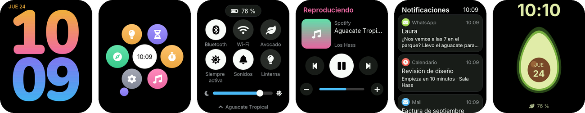

Tiene dos estilos: el **limpio**, activo por defecto, y el **Modo Avocado**, que cambia la paleta y añade guiños de aguacate a las esferas, la cuadrícula de apps y la animación de carga.

> Proyecto personal y no oficial. No está afiliado a Apple ni a Waveshare.

## Capturas

Capturas del simulador de escritorio, que usa exactamente la misma interfaz que el reloj.

| Esfera Flux | Modular | Cronógrafo | Apps (panal) |
|---|---|---|---|
| 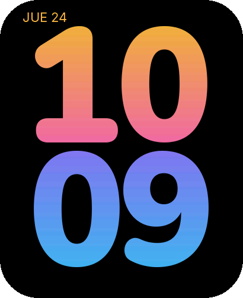 | 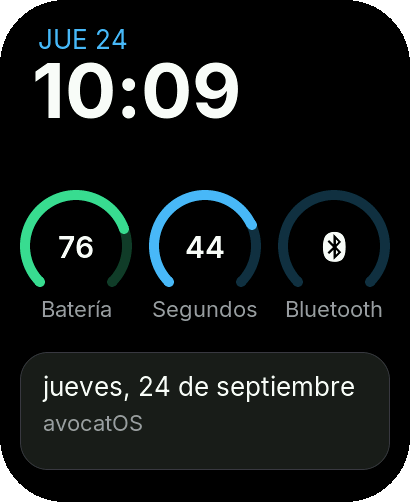 | 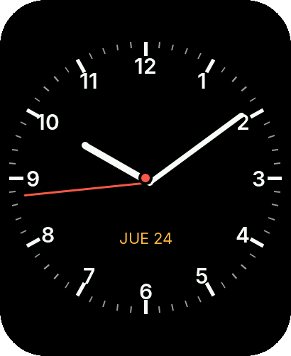 | 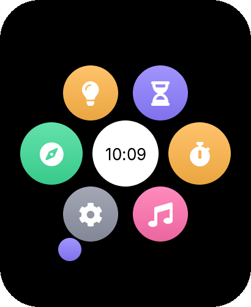 |
| **Centro de control** | **Reproduciendo** | **Notificaciones** | **Detalle** |
| 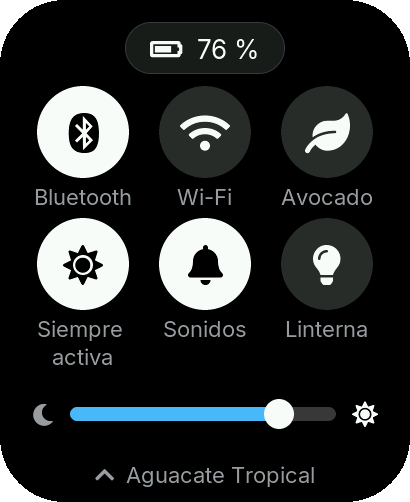 | 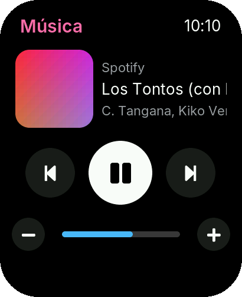 | 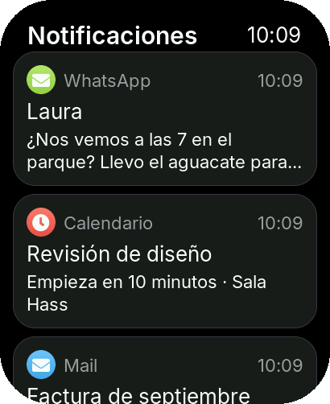 | 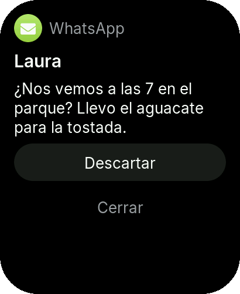 |
| **Smart Stack** | **Ajustes** | **Aviso** | **Llamada entrante** |
| 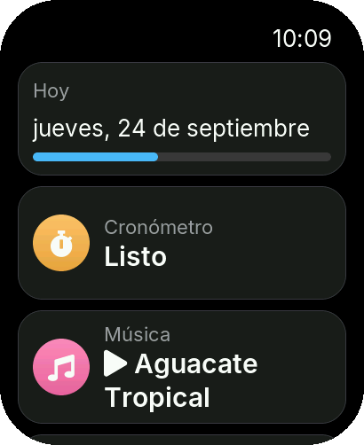 | 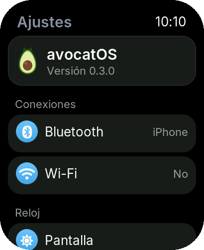 | 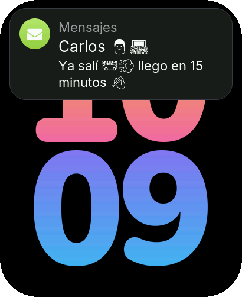 | 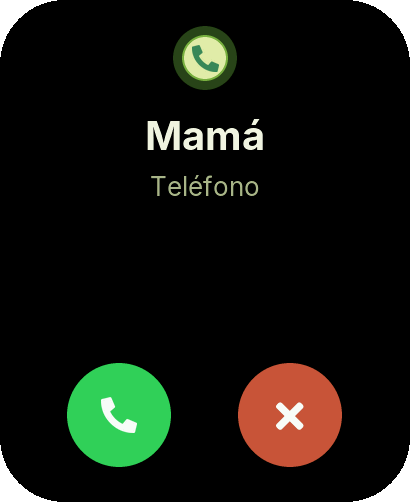 |
| **Modo Avocado: esfera Hass** | **Panal Avocado** | **Siempre activa** | **Cargando (Avocado)** |
| 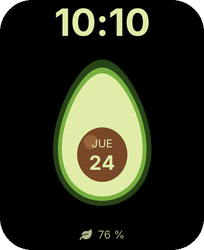 | 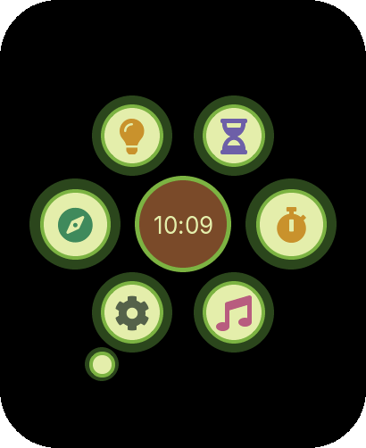 | 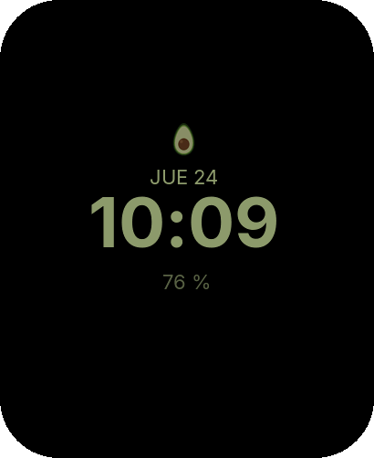 | 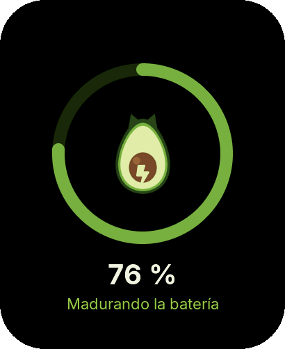 |

## Qué incluye

| Área | Contenido |
|---|---|
| Esferas | Flux (dígitos con degradado), Modular (complicaciones), Cronógrafo (analógica) y Hass (solo en Modo Avocado) |
| Apps | Cuadrícula en panal con efecto lupa: Ajustes, Música, Cronómetro, Temporizador, Linterna, Nivel, Esferas |
| iPhone | Notificaciones con acciones (ANCS), llamadas entrantes (aceptar/rechazar), control de música y volumen (AMS), hora del teléfono (CTS) |
| Música | Página *Reproduciendo* bajo el Centro de control, con carátula descargada por Wi-Fi |
| Sistema | Centro de control, Smart Stack, pantalla siempre activa (anti-quemado), animación de carga, levantar la muñeca para activar |
| Ajustes | Bluetooth (emparejar/olvidar iPhone), Wi-Fi (buscar, contraseña, NTP), Pantalla, Apariencia, Hora, Información, Desarrollador (FPS) |
| Texto | Inter para el texto, Noto Emoji monocromo como respaldo para los emojis de las notificaciones (sin compresión RLE, ver [lvgl/lvgl#10293](https://github.com/lvgl/lvgl/issues/10293)) |

## Gestos y botones

| Dónde | Gesto | Acción |
|---|---|---|
| Esfera | ↑ desde abajo | Smart Stack (↓ para cerrarlo) |
| Esfera | ↓ desde arriba | Notificaciones |
| Esfera | ← → | Cambiar de esfera |
| Esfera | mantener pulsado | Elegir esfera |
| Apps y submenús | → | Atrás |
| Notificaciones | ↑ desde el borde inferior o → | Volver a la esfera (desplazar la lista nunca la cierra) |
| Botón **BOOT** | pulsar | Esfera ↔ apps (doble pulsación: última app) |
| Botón **PWR** | pulsar / mantener | Centro de control (dentro, ↑ = Reproduciendo) / dormir |

## Hardware

Waveshare **ESP32-S3-Touch-AMOLED-2.06**:
- ESP32-S3R8 con 8 MB de PSRAM y 32 MB de flash.
- AMOLED 410×502 con controlador CO5300 por QSPI, y táctil FT3168.
- Gestor de energía AXP2101, IMU QMI8658 y reloj RTC PCF85063.

## Estructura

```
components/
  avo_core/   lógica pura, sin hardware y con pruebas: panal, hora, energía, gestos, parsers ANCS/AMS/CTS, texto
  avo_hal/    contrato de hardware que usa la interfaz
  avo_ui/     interfaz LVGL 9.5: tema, navegación, esferas, paneles, apps, recursos generados
  avo_board/  placa real: pantalla QSPI a 80 MHz, táctil, AXP2101, QMI8658, PCF85063, botones, Wi-Fi, BLE (NimBLE), carátulas
sim/          simulador de escritorio (SDL2) con la misma interfaz y pruebas de gestos de extremo a extremo
tests/        pruebas unitarias de avo_core
tools/        idf.sh (entorno ESP-IDF 6.0.3) y gen_assets.py (fuentes e imágenes)
```

## Compilar

Requisitos: **ESP-IDF v6.0.3**. `tools/idf.sh` espera encontrarlo en `~/esp/esp-idf-v6.0.3`.

```bash
make -C tests                                   # pruebas unitarias
./tools/idf.sh build                            # compilar firmware
./tools/idf.sh -p /dev/cu.usbmodemXXXX flash monitor
```

Simulador. Necesita SDL2 (`brew install sdl2`) y usa el cmake y el ninja que instala ESP-IDF:

```bash
cmake -S sim -B sim/build -G Ninja && cmake --build sim/build
./sim/build/avocatos_sim                        # ventana: el ratón hace de dedo; b/d/p/l = botones
./sim/build/avocatos_sim --shots /tmp/shots     # capturas de todas las pantallas y pruebas de gestos
```

Para regenerar fuentes e imágenes: `python tools/gen_assets.py`. Usa `lv_font_conv` mediante `npx`.

## Conectar el iPhone

Desde iOS 18, *Ajustes › Bluetooth* no muestra accesorios BLE genéricos. Solo hay que emparejar el reloj una vez:
1. Instala **nRF Connect** o **LightBlue** en el iPhone.
2. Busca `avocatOS` y conéctate.
3. Acepta la solicitud de emparejamiento.

A partir de ahí el iPhone se reconecta solo. Comparte las notificaciones si activas *Compartir notificaciones del sistema* en el propio dispositivo emparejado.

## Privacidad

- Para mostrar la carátula, el reloj envía el **artista y el título** de la canción a la API pública de búsqueda de iTunes (Apple), por HTTPS y solo con Wi-Fi.
- Las notificaciones no salen del reloj y solo se guardan en RAM.
- La contraseña del Wi-Fi se guarda en la NVS del reloj.

## Seguridad del dispositivo

- Secure boot y cifrado de flash están desactivados de forma explícita en `sdkconfig.defaults`. Nunca se escriben eFuses.
- Del AXP2101 solo se escriben registros de medida y de eventos de botón, nunca tensiones.
- Antes de flashear, haz una copia del firmware de fábrica con `esptool.py read_flash`.

## Rendimiento

El BSP oficial usa QSPI a 40 MHz y un único buffer de 20 líneas en PSRAM. avocatOS usa:
- QSPI a 80 MHz;
- buffers DMA dobles en RAM interna;
- LVGL en el núcleo 1 con dos hilos de dibujo;
- el heap de LVGL en PSRAM, para que Wi-Fi y Bluetooth quepan a la vez en la RAM interna.

## Licencias

- **Código de avocatOS:** MIT (ver [`LICENSE`](LICENSE)).
- **Fuentes:** Inter, Nunito y Noto Emoji, con licencia SIL OFL 1.1 (ver `assets/fonts/OFL-*.txt`).
- **Símbolos:** FontAwesome 5 Free, incluidos con LVGL.
- **Dependencias:** LVGL (MIT); esp_lvgl_port, esp_lcd_sh8601 y esp_jpeg (Apache 2.0).
- La marca de aguacate la dibuja `tools/gen_assets.py`.
